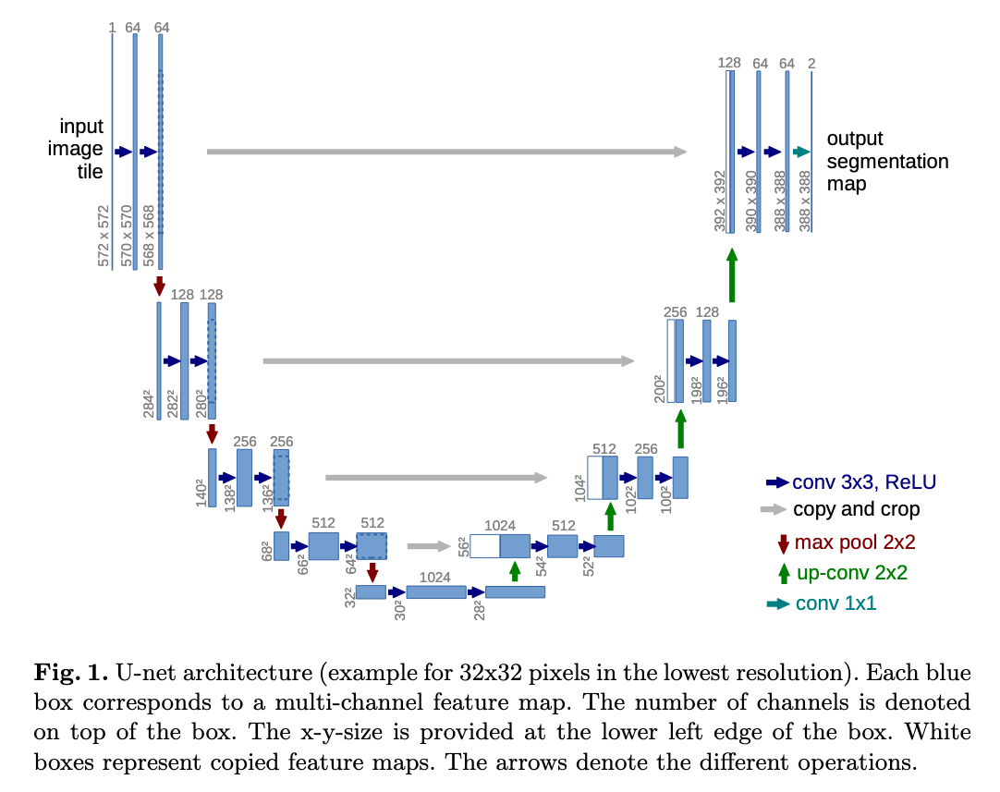
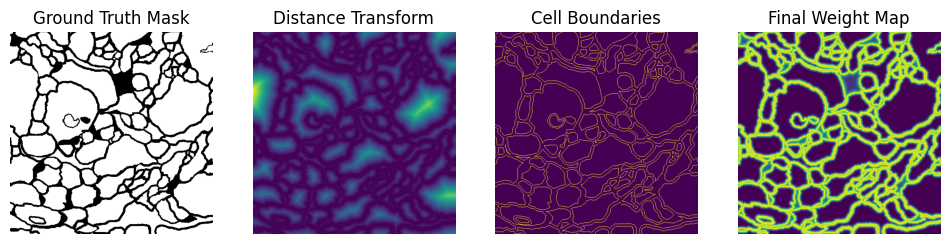
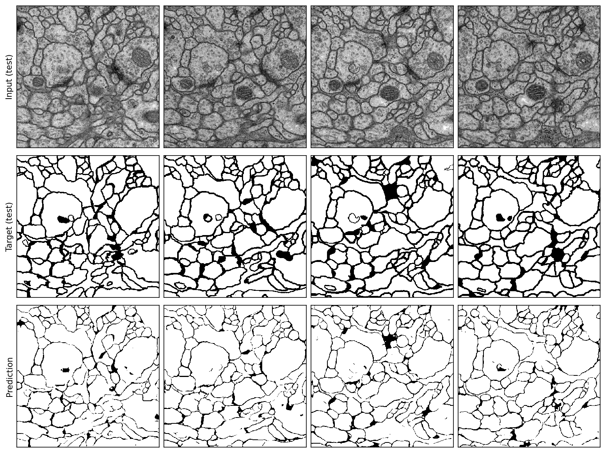

# unet
A PyTorch reimplementation of the **U-Net** architecture for image segmentation, originally introduced in the paper ["U-Net: Convolutional Networks for Biomedical Image Segmentation"](https://lmb.informatik.uni-freiburg.de/Publications/2015/RFB15a/), Ronneberger, Brox and Fischer (2015).



*Taken from ["U-Net: Convolutional Networks for Biomedical Image Segmentation"](https://lmb.informatik.uni-freiburg.de/Publications/2015/RFB15a/), Brox, Ronneberger, Fischer (2015).*

## Usage

```python
import torch
from unet.unet import UNet


unet = Unet(in_channels=1, out_channels=2)

# input shape [64, 1, 572, 572]
input = torch.rand((64, 1, 572, 572))

# output shape [64, 2, 388, 388]
output = unet(input)
```

## Reproducing the ISBI-2012 challange: Segmentation of neuronal structures in EM stacks
The ISBI-2012 challange ["Segmentation of neuronal structures in EM stacks"](https://imagej.net/events/isbi-2012-segmentation-challenge) was part of a workshop 
held in conjunction with the IEEE International Symposium on Biomedical Imaging (ISBI) 2012 challange. 

Given a full stack of EM slices, the goal is to produce a full segmentation of the neuronal structures. You can fine more details in my notebook [ISBI_2012_demo.ipynb](./ISBI_2012_demo.ipynb), or [here](https://imagej.net/events/isbi-2012-segmentation-challenge).

Read more in ["U-Net: Convolutional Networks for Biomedical Image Segmentation"](https://lmb.informatik.uni-freiburg.de/Publications/2015/RFB15a/) to get more information about training details, especially for the weight map.



Create the training and validation datasets by runnning:

```bash
python3 prepro.py --num_train_samples=25000 --num_val_samples=2500 --w0=10.0 --sigma=5.0 --seed=42 --verbose=True
```

Search for optimal hyperparameters by using:

```bash
python3 hyper_search.py --n_trials=100 --epochs_per_trial=10 --device=cuda --seed=42
```

Train the final model with the best hyperparameters:

```bash
python3 train.py --epochs=10 --learning_rate=`hyper_lr` --gamme=`hyper_gamma` --momentum=0.99 --device=cuda --seed=42 --verbose=True
```

#### U-Net Inference (on Test Data)



## Experimental Setup

* OS: Fedora Linux 42 (Workstation Edition) x86_64
* CPU: AMD Ryzen 5 2600X (12) @ 3.60 GHz
* GPU: NVIDIA GeForce RTX 2060 Rev. A [Discrete]
* RAM: 32 GB DDR4 3200 MHz

## Citations

```bibtex
@InProceedings{RFB15a,
  author       = "O. Ronneberger and P.Fischer and T. Brox",
  title        = "U-Net: Convolutional Networks for Biomedical Image Segmentation",
  booktitle    = "Medical Image Computing and Computer-Assisted Intervention (MICCAI)",
  series       = "LNCS",
  volume       = "9351",
  pages        = "234--241",
  year         = "2015",
  publisher    = "Springer",
  note         = "(available on arXiv:1505.04597 [cs.CV])",
  url          = "http://lmb.informatik.uni-freiburg.de/Publications/2015/RFB15a"
}
```

```bibtex
@misc{isbi2012challenge,
  title        = {Segmentation of Neuronal Structures in EM Stacks Challenge --- ISBI 2012},
  author       = {Ignacio Arganda-Carreras and Sebastian Seung and Albert Cardona and Johannes Schindelin},
  year         = {2012},
  howpublished = {Challenge workshop at the IEEE International Symposium on Biomedical Imaging (ISBI)},
  note         = {Barcelona, Spain, May 2--5, 2012. \url{https://imagej.net/events/isbi-2012-segmentation-challenge}},
}
```